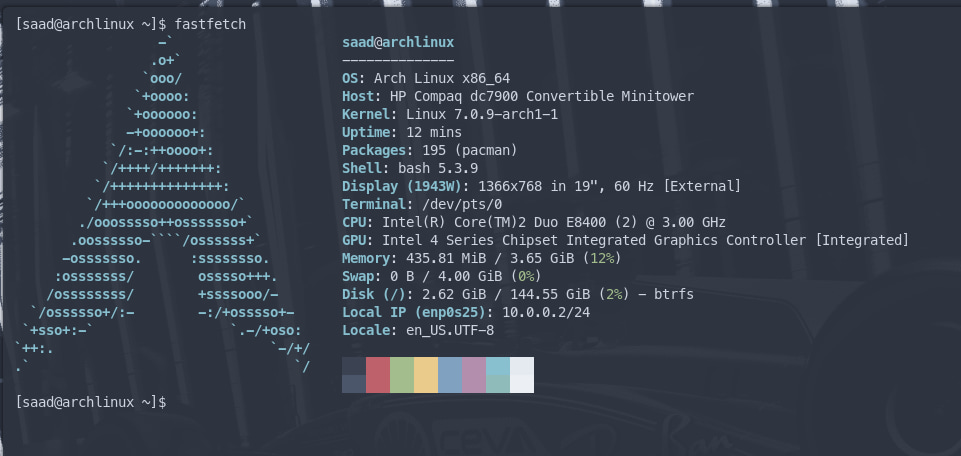
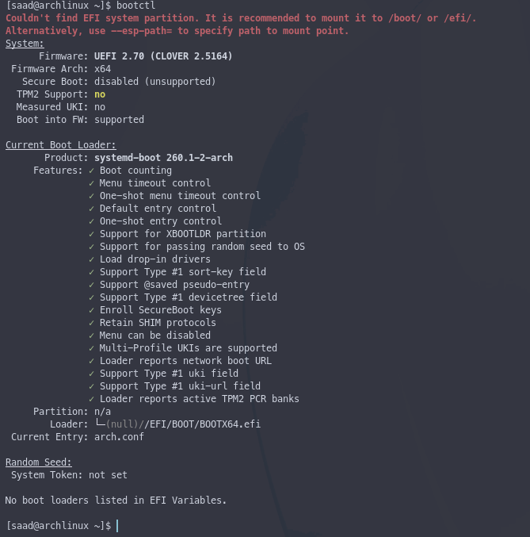

<div align="center">

[](https://github.com/Saad-Dev-8)
[](./LICENSE)

</div>

<h1 align="center">Arch Linux on Legacy BIOS Installation Guide</h1>

<div align="center">
    <i>A guide for installing Arch Linux on a legacy BIOS (non-UEFI) machine using Clover as a UEFI emulator.
</i>
</div>

## Overview

Legacy BIOS machines(like office machines with no UEFI) cannot natively run UEFI **based** applications, bootloaders, etc. Clover solves this by loading from the MBR and providing a full emulated UEFI environment, allowing bootloader to run on top of it as if real UEFI firmware were present.

Boot sequence:
```
BIOS → Clover (MBR boot code) → Clover EFI (UEFI emulation) → Bootloader → Linux kernel
```

---

## 1. Partitioning

Boot into the Arch live ISO and list the available disk drive using `lsblk` 

```bash 
lsblk
```
it will list all of your available disks like this:

```bash
NAME   MAJ:MIN RM   SIZE RO TYPE MOUNTPOINTS
sda      8:0    0 465.8G  0 disk 
sdb      8:16   0 298.1G  0 disk 
├─sdb1   8:17   0     1G  0 part /boot/efi
├─sdb2   8:18   0     4G  0 part [SWAP]
└─sdb3   8:19   0 293.1G  0 part /
sdc      8:32   1   7.3G  0 disk 
├─sdc1   8:33   1   1.2G  0 part 
└─sdc2   8:34   1   253M  0 part
```
**Make sure to use the correct otherwise your data in that drive will be GONE.**

In this example, we will be using `sda`

Partition the disk using `cfdisk`:

```bash
cfdisk /dev/sda
```

- Select **dos** (MBR) as the partition table type
- Create the following layout:

| Partition | Size  | Type       | Mount Point | Notes          |
|-----------|-------|------------|-------------|----------------|
| /dev/sda1 | 512M  | Linux      | /boot       | Mark bootable  |
| /dev/sda2 | 4G    | Linux swap | [SWAP]      | Change type to 82 |
| /dev/sda3 | Rest  | Linux      | /           |                |

Write and quit cfdisk.

### Format the Partitions

> **Important:** `/boot` must be FAT32 for systemd-boot to work.

```bash
mkfs.fat -F32 -n EFI /dev/sda1
mkswap /dev/sda2
mkfs.btrfs /dev/sda3
```

### Mount the Partitions

```bash
mount /dev/sda3 /mnt
mkdir /mnt/boot
mount /dev/sda1 /mnt/boot
swapon /dev/sda2
```

---

## 2. Base Installation

```bash
pacstrap -K /mnt base base-devel linux linux-firmware btrfs-progs networkmanager nano vim sudo
```

### Generate fstab

```bash
genfstab -U /mnt >> /mnt/etc/fstab
```

### Chroot

```bash
arch-chroot /mnt
```

### Basic Configuration

```bash
# Timezone
ln -sf /usr/share/zoneinfo/Asia/Kolkata /etc/localtime
hwclock --systohc

# Locale
nano /etc/locale.gen        # Uncomment en_US.UTF-8 UTF-8
locale-gen
echo "LANG=en_US.UTF-8" > /etc/locale.conf

# Hostname
echo "arch-btw" > /etc/hostname

# Root password
passwd

# Create user
useradd -m -G wheel -s /bin/bash john
passwd john

# Enable sudo for wheel group
EDITOR=nano(or vim) visudo            # Uncomment %wheel ALL=(ALL:ALL) ALL
```

In `# Hostname` replace `arch-btw` to your favourite hostname

Also in `# Create user` replace `john` with your username

---

## 3. Clover Setup (UEFI Emulation)

Clover provides a UEFI environment on legacy BIOS machines. It reads `boot6` from the FAT32 partition root and loads `CloverX64.efi`.

### Download Clover ISO

Exit chroot first, then:

```bash
curl -L https://github.com/CloverHackyColor/CloverBootloader/releases/download/5164/Clover-5164-X64.iso.7z -o clover.iso.7z
7z x clover.iso.7z
mkdir clover-iso
mount -o loop Clover-5164-X64.iso clover-iso
```

### Write Boot Sectors

This method safely patches the MBR and PBR while preserving the FAT32 filesystem metadata:

```bash
# Back up originals
dd if=/dev/sda count=1 bs=512 of=origMBR
dd if=/dev/sda1 count=1 bs=512 of=origbs

# Patch MBR with Clover boot code (preserves partition table)
cp origMBR newMBR
dd if=clover-iso/usr/standalone/i386/boot0af of=newMBR bs=1 count=440 conv=notrunc
dd if=newMBR of=/dev/sda count=1 bs=512

# Patch PBR with Clover boot code (preserves FAT32 BPB metadata)
cp clover-iso/usr/standalone/i386/boot1f32alt newbs
dd if=origbs of=newbs skip=3 seek=3 bs=1 count=87 conv=notrunc
dd if=newbs of=/dev/sda1 count=1 bs=512
```

> **Note:** Never write `boot1f32alt` directly to the partition with a simple `dd` — it will corrupt the FAT32 filesystem by overwriting the BPB (BIOS Parameter Block). The method above preserves bytes 3–90 of the original boot sector which contain the FAT32 metadata.

### Copy Clover EFI Files

```bash
mkdir -p /mnt/boot/EFI/CLOVER
cp clover-iso/usr/standalone/i386/x64/boot6 /mnt/boot/boot
cp -r clover-iso/efi/clover/* /mnt/boot/EFI/CLOVER/
```

### Clover `config.plist`

Replace the default Hackintosh config with a minimal Linux config:

```bash
cat > /mnt/boot/EFI/CLOVER/config.plist << 'EOF'
<?xml version="1.0" encoding="UTF-8"?>
<!DOCTYPE plist PUBLIC "-//Apple//DTD PLIST 1.0//EN" "http://www.apple.com/DTDs/PropertyList-1.0.dtd">
<plist version="1.0">
<dict>
    <key>Boot</key>
    <dict>
        <key>DefaultVolume</key>
        <string>EFI</string>
        <key>DefaultLoader</key>
        <string>\EFI\systemd\systemd-bootx64.efi</string>
        <key>Fast</key>
        <true/>
    </dict>
    <key>GUI</key>
    <dict>
        <key>Custom</key>
        <dict>
            <key>Entries</key>
            <array>
                <dict>
                    <key>Hidden</key>
                    <false/>
                    <key>Disabled</key>
                    <false/>
                    <key>Image</key>
                    <string>os_arch</string>
                    <key>Volume</key>
                    <string>YOUR-BOOT-PARTUUID</string>
                    <key>Path</key>
                    <string>\EFI\systemd\systemd-bootx64.efi</string>
                    <key>Title</key>
                    <string>Arch Linux</string>
                    <key>Type</key>
                    <string>Linux</string>
                </dict>
            </array>
        </dict>
    </dict>
</dict>
</plist>
EOF
```

Replace `YOUR-BOOT-PARTUUID` with the PARTUUID of `/dev/sda1` in uppercase, obtained from:

```bash
blkid /dev/sda1
```

---

## 4. systemd-boot Setup

Chroot back in and install systemd-boot:

```bash
arch-chroot /mnt
bootctl --path=/boot install
```

### loader.conf

```bash
cat > /boot/loader/loader.conf << 'EOF'
default arch.conf
timeout 0
console-mode max
EOF
```

### Boot Entry

Get the root partition UUID first:

```bash
blkid /dev/sda3   # note the UUID value
```

Then create the entry:

```bash
cat > /boot/loader/entries/arch.conf << 'EOF'
title   Arch Linux
linux   /vmlinuz-linux
initrd  /initramfs-linux.img
options root=UUID=YOUR-ROOT-UUID rw nowatchdog
EOF
```

Replace `YOUR-ROOT-UUID` with the UUID of `/dev/sda3`.

### Build Initramfs

```bash
pacman -S linux    # reinstalls kernel and triggers mkinitcpio
```

---

## 5. Verify Boot

After rebooting, confirm Clover is emulating UEFI:

```bash
bootctl status
```

You should see:
```
Firmware: UEFI 2.70 (CLOVER 2.5164)
```

This confirms the full Clover UEFI Environment.

---

## Troubleshooting

**"Not a bootable disk"** — The boot flag is not set on sda1. Run `cfdisk /dev/sda`, highlight sda1, select Bootable, then Write. Also rewrite the MBR boot sector with `boot0af`.

**fstab UUID mismatch** — If you reformat `/boot`, its UUID changes. Update `/etc/fstab` with the new UUID from `blkid /dev/sda1`.

**boot1f32 corrupts FAT32** — Never write `boot1f32` or `boot1f32alt` directly to the partition. Always use the BPB-preserving dd method described above.

---

- This Installation was tested in a **HP Compaq DC7900 Convertible Minitower**




